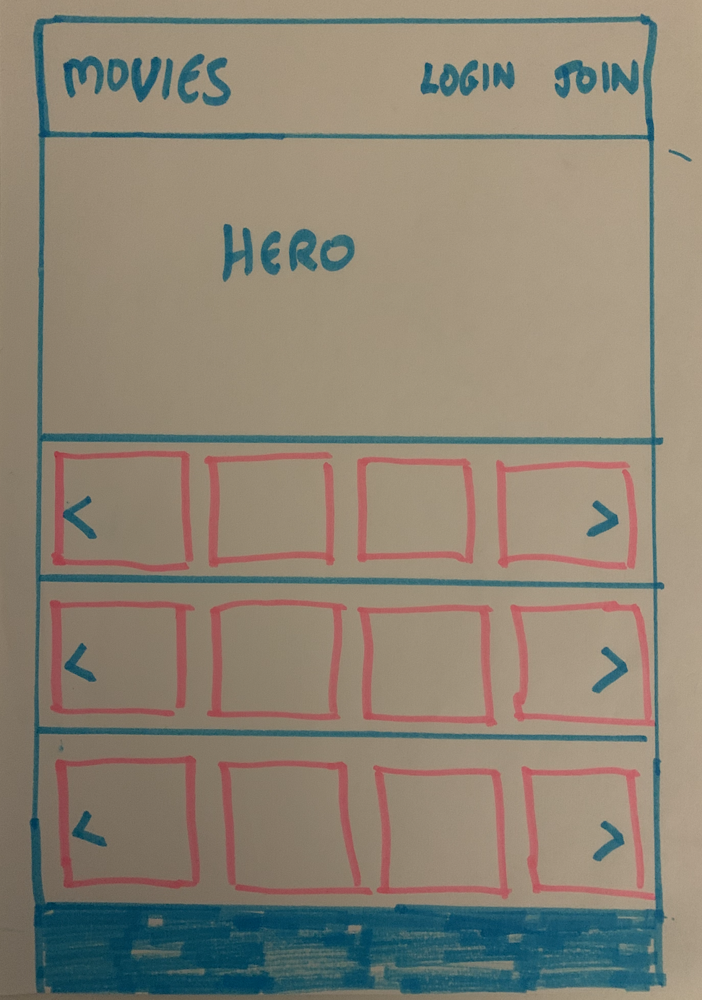
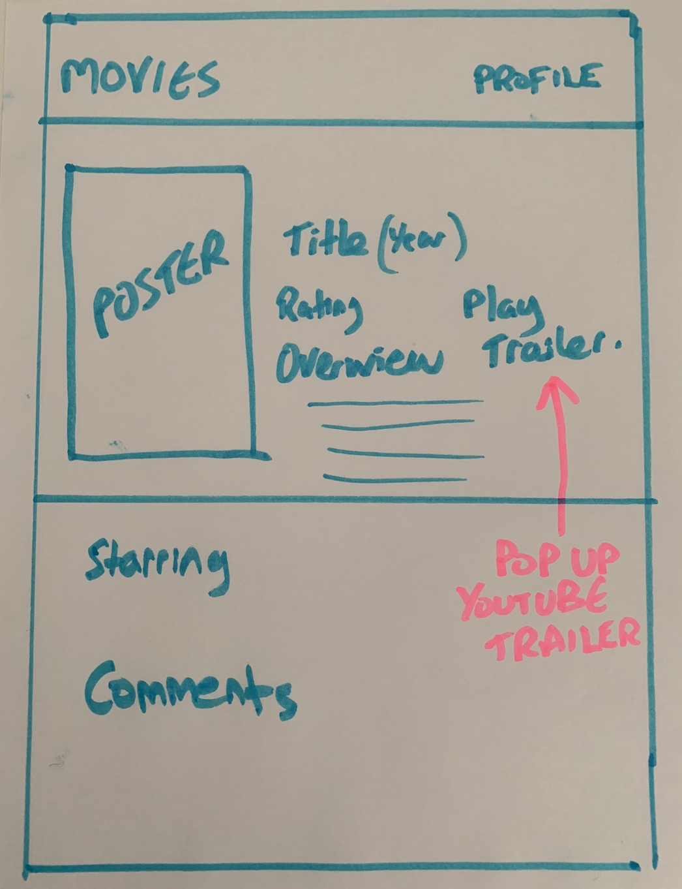
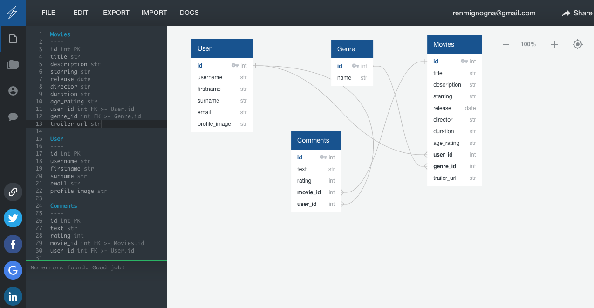
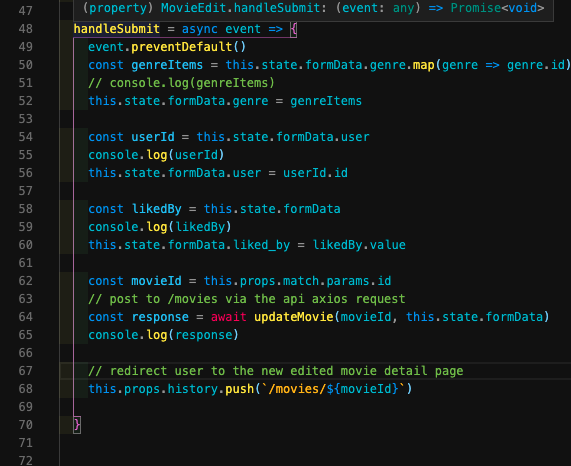
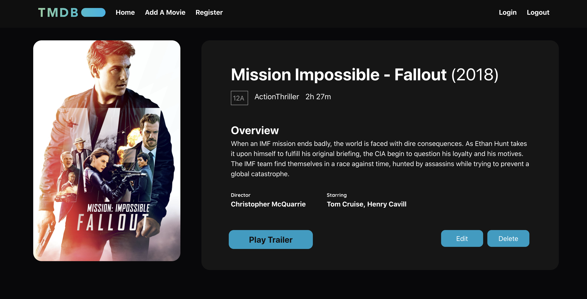

## Goal: To build a full stack application using Django REST and React JS

# **My Project - Movies Database**

## **Overview**
For my final project I created a movies database that showcases popular movies based on categories. The app allows users to view movie information including a Youtube trailer. Users can view and comment on any movie and add their own rating.

The app has full CRUD functionality, so users can register and login. Once logged in users can then upload their own movie and create a listing with the required information. They can also edit their own movies and delete them if needed.

Categories were created to allow users to find movies in certain categories such as "Action Comedies"

The app was built using Django and Django REST Framwork with a Postgres database for the backend, and React JS for frontend.

 

## **Launch The App**
https://movies-tmbd.herokuapp.com/

 

## **Check Out The GitHub Repo**
<https://github.com/renato76/sei-project-4>

 

## Features Required: 

* use Django REST Framework to serve data from a Postgres database
* Consume the API with a separate front-end built with React
* Must have CRUD fnctionality
* Thoughtful user stories  
* Impressive design

### **Timeframe**

* 9 days  

### **Technologies Used**

* React JS
* Django
* Django REST Framework
* Postgres
* CSS
* Bulma

### **Dev Tools**

* VS Code
* Git
* GitHub
* TablePlus
* Insomnia
* Google Fonts
* Chrome Developer Tools
* Axios
* Quickdatabasediagrams.com

 
 

**Here is a screenshot of the homepage**

 
 

## **Approach**
My approach was work entirely on back end first, and then once that was complete start working on the front end in React.

First of all I planned how the app should function and what the user should be able to see and do. 

Then I created simple wireframes to reflect this. 

 
 

 
 

**ERD Diagram**

Using an ERD diagram I planned which models and fields would be required. This allowed me to create the Components and fields alongside the relationships between fields. The diagram illustrates how the movies, users and comments are related through one-to-many and many-to-many relationships.

 

 
 

## **Challenges**
The main challenges were first of all building the back end with Django REST Framework, understanding the error messages and dealing with them was challenging, I used the Django Documentation to guide me with a lot of these.

Here is a screenshot of the code to fix the error messages regarding the type of information being submitted to the formData:

Another main challenge was when working on the frontend in React, getting the data across to back end in the correct format exactly as setout on the backend. This was a great learning curve in understanding error messages and providing the correct code to fix them. 

The main thing I learned from these was to take a systematic approach and aso use pseudo code to write out each step of the solution.

 
 

## **Wins**

One really great win was getting the backend setup correctly, with the right fields and relationships which include user profiles, likes, comments and ratings. This meant I was then able to set these features up at the frontend.

The styling was also a great win for me, the homepage contain rows of movies influenced by Amazon Prime and Netflix. I created rows of movies in certain categories with a hidden scrollbar and with a grow effect as you hover over each movie.

The details of the movies was styled with a view to giving users all the info they require about a movie, whilst also making the page visually impressive.

 

## **Screenshot of Homepage**

 
 

## **Screenshot of Movie Details Page**

 
 

## **Future Features**

I am really excited to carry on working on this in the future. Initially I will add more movies and more categories to choose from.

Users will be able to clearly see if they are logged in, I will also display success and error messages to the user for registration, login, logout, create movie etc. 

A Profile page feature will be added allowing users to see their own profile with information such as which movies they liked, and which comments they left on movies. I would also like to add an "Add to favourites" feature which will need some modifications in the back end as well.

I plan to show and hide certain links depending on whether a user is logged in or not. For example a user will only be able to see register and Login until they are logged in at which point they will only be able to see the Logout, Add A Movie and their own Profile page.

Currently this is built for desktop, so I will need to make it responsive for tablets and mobile devices.

 
 

## **Installation Instructions**

* Install Django - "pipenv install django"
* Enter Shell - "pipenv shell"
* Run Backend Server - "python manage. py runserver" 
* Install Dependencies - "npm i"
* Launch the app locally - "npm start"

